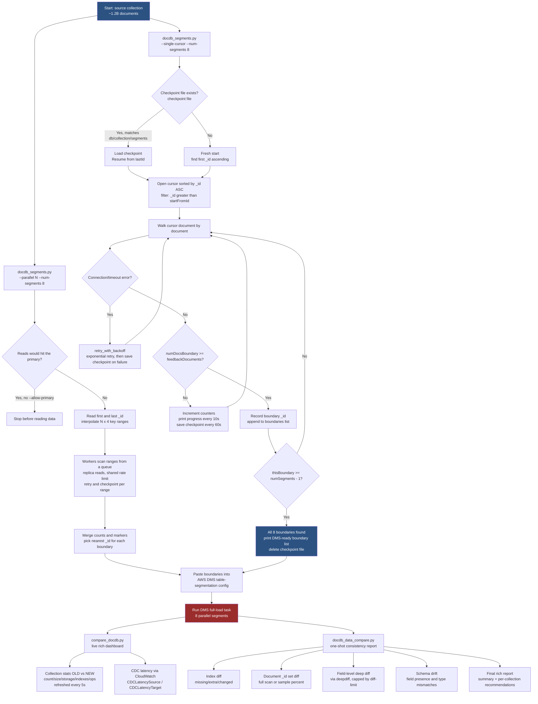

# DMS Segmentation & Comparison Workflow

Visual reference for how `docdb_segments.py`, `compare_docdb.py`, and
`docdb_data_compare.py` fit together in a DMS migration. See [README.md](README.md) for full script-level detail.

